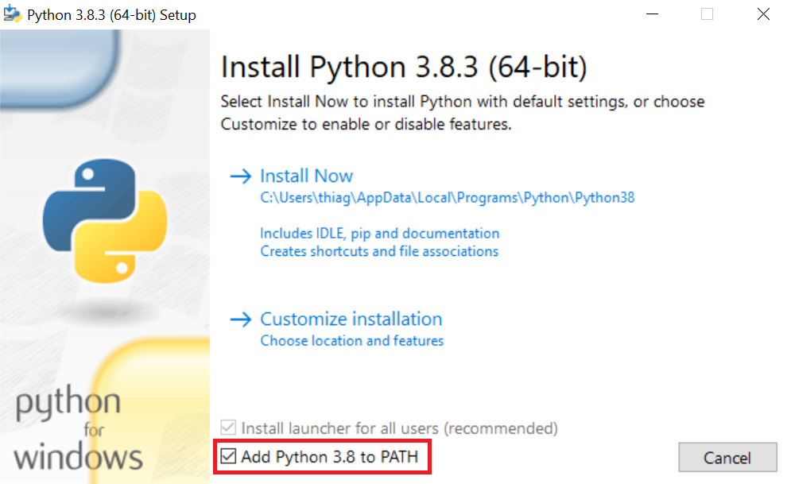

Pdf Split Tool
==============

**MAINTAINER NEEDED: this project is complete but won't be updated until further notice. If you have interest in improving it, please contact me by creating an** `issue here`_ **.**

|PyPI| |Python Version| |License|

|Read the Docs| |Tests| |Codecov|

|pre-commit| |Black|

.. |PyPI| image:: https://img.shields.io/pypi/v/pdf-split-tool.svg
   :target: https://pypi.org/project/pdf-split-tool/
   :alt: PyPI
.. |Python Version| image:: https://img.shields.io/pypi/pyversions/pdf-split-tool
   :target: https://pypi.org/project/pdf-split-tool
   :alt: Python Version
.. |License| image:: https://img.shields.io/pypi/l/pdf-split-tool
   :target: https://opensource.org/licenses/MIT
   :alt: License
.. |Read the Docs| image:: https://img.shields.io/readthedocs/pdf-split-tool/latest.svg?label=Read%20the%20Docs
   :target: https://pdf-split-tool.readthedocs.io/
   :alt: Read the documentation at https://pdf-split-tool.readthedocs.io/
.. |Tests| image:: https://github.com/staticdev/pdf-split-tool/workflows/Tests/badge.svg
   :target: https://github.com/staticdev/pdf-split-tool/actions?workflow=Tests
   :alt: Tests
.. |Codecov| image:: https://codecov.io/gh/staticdev/pdf-split-tool/branch/master/graph/badge.svg
   :target: https://codecov.io/gh/staticdev/pdf-split-tool
   :alt: Codecov
.. |pre-commit| image:: https://img.shields.io/badge/pre--commit-enabled-brightgreen?logo=pre-commit&logoColor=white
   :target: https://github.com/pre-commit/pre-commit
   :alt: pre-commit
.. |Black| image:: https://img.shields.io/badge/code%20style-black-000000.svg
   :target: https://github.com/psf/black
   :alt: Black

Features
--------

* Cross-platform: Windows, Mac, and Linux are officially supported.
* Works with Python 3.8 and 3.9.
* Splits documents by max size.
* Checks for high-resolution PDFs before splitting.

Requirements
------------

You need Python 3.8 or above (3.9 recommended) installed on your machine.

Windows users should download `Windows x86-64 executable installer` and in the installer screen be ensure the option `Add Python 3.8 to PATH` is checked:

Installation
------------

You can install *Pdf Split Tool* via pip_ from PyPI_:

.. code:: console

   pip install pdf-split-tool

Note: on Windows you can copy the above command in the `cmd` program.

Usage
-----

1) Enter the terminal of your operating system eg. `cmd` program on Windows or shell on Linux and MacOS.

2) Choose the one option and execute the command on the terminal:

* For splits with the default value (20mb) of a specific PDF

.. code:: console

   pdf-split-tool C:\Users\John\myfile.pdf

* For splits with the default value (20mb) of all PDFs in a folder

.. code:: console

   pdf-split-tool

* You can choose the max size in megabytes with the option `-m` or `--max-size`

.. code:: console

   pdf-split-tool --max-size 50 # for 50 megabytes

Note: you can also use --max-size after the path of a specific PDF and fractional numbers such as "50.5".

Contributing
------------

Contributions are very welcome.
To learn more, see the `Contributor Guide`_.

License
-------

Distributed under the terms of the MIT_ license,
*Pdf Split Tool* is free and open source software.

Issues
------

If you encounter any problems,
please `file an issue`_ along with a detailed description.

Credits
-------

This project was generated from `@cjolowicz`_'s `Hypermodern Python Cookiecutter`_ template.

.. _issue here: https://github.com/staticdev/staticdev/issues
.. _@cjolowicz: https://github.com/cjolowicz
.. _Cookiecutter: https://github.com/audreyr/cookiecutter
.. _MIT: http://opensource.org/licenses/MIT
.. _PyPI: https://pypi.org/
.. _Hypermodern Python Cookiecutter: https://github.com/cjolowicz/cookiecutter-hypermodern-python
.. _file an issue: https://github.com/staticdev/pdf-split-tool/issues
.. _pip: https://pip.pypa.io/
.. github-only
.. _Contributor Guide: CONTRIBUTING.rst
